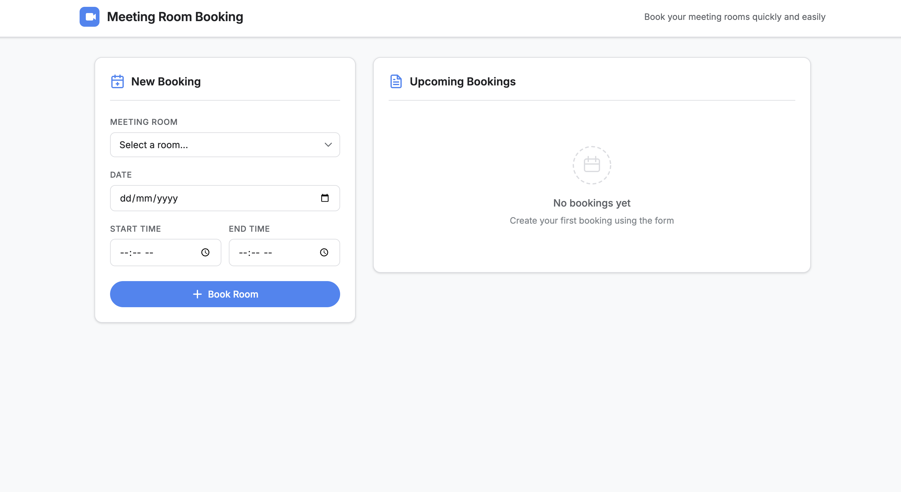
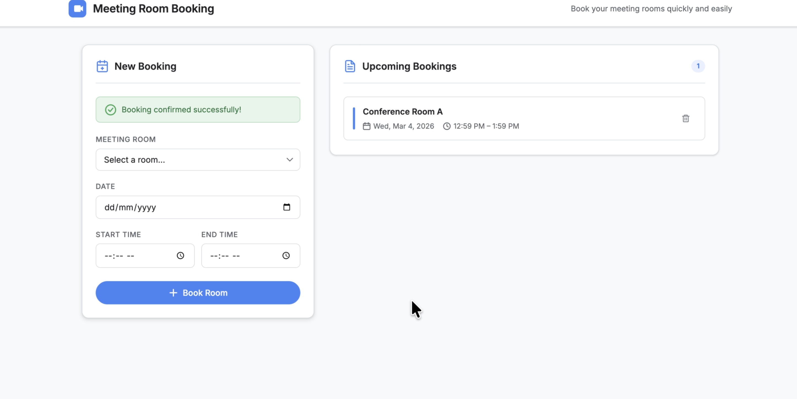
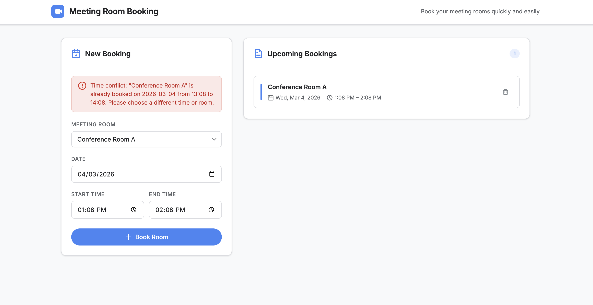
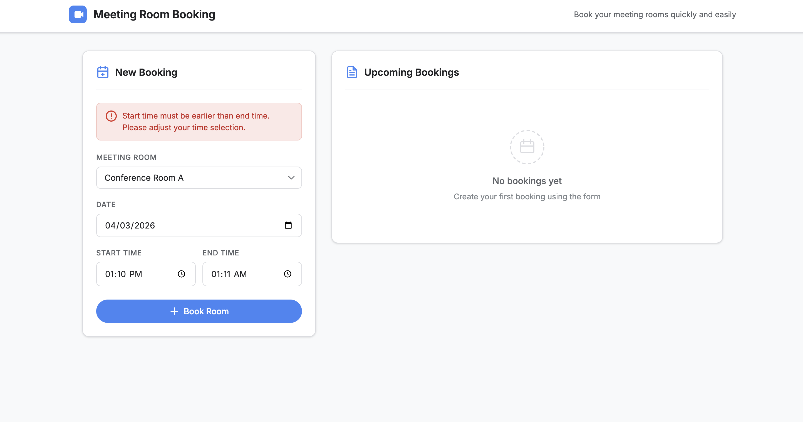
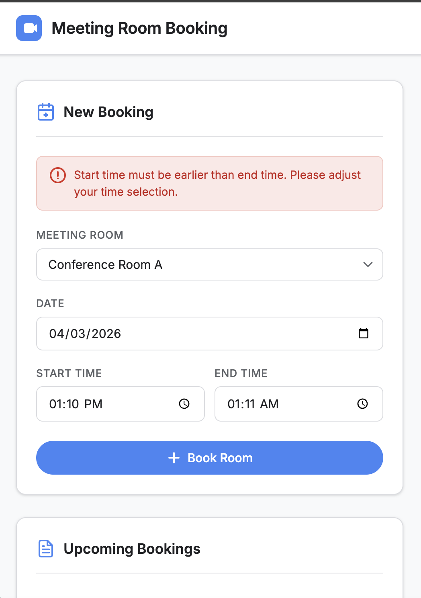

# 🏢 React Meeting Room Booking System

A modern, responsive React-based meeting room booking system with a Google Workspace-inspired UI. Quickly book predefined rooms, view upcoming bookings, and get instant feedback on scheduling conflicts.


---

## 📸 Screenshots

### 🖥️ Desktop — Empty State
> Clean two-column layout with the booking form on the left and an empty bookings panel on the right.



### ✅ Booking Confirmed Successfully
> After creating a booking, a green success toast appears and the booking shows up in the "Upcoming Bookings" list.



### ⚠️ Time Validation Error (Desktop)
> Start time must be earlier than end time — the form shows a clear inline error message.



### 🚫 Time Conflict Error
> Attempting to double-book "Conference Room A" at an overlapping time shows a detailed conflict message.



### 📱 Mobile — Time Validation Error
> Fully responsive layout stacks the form and bookings list vertically on smaller screens.



---

## ✨ Features

| Feature | Description |
|---|---|
| 🏠 **3 Predefined Rooms** | Conference Room A, Meeting Room B, Board Room C — each with a unique color indicator |
| 🚫 **Overlap Prevention** | Prevents double-booking the same room at overlapping times |
| ⏰ **Time Validation** | Ensures start time is earlier than end time |
| 💬 **Meaningful Errors** | Specific error messages showing which room and time slot conflicts |
| ✅ **Success Feedback** | Confirmation message with auto-dismiss after 3 seconds |
| 🎨 **Modern UI** | Clean, Google Workspace-inspired design with white & blue theme |
| 📱 **Fully Responsive** | Adapts seamlessly to desktop, tablet, and mobile screens |
| 🗑️ **Cancel Bookings** | Delete any booking with a single click |
| 📅 **Date Restriction** | Cannot book rooms in the past (min date = today) |
| 🔃 **Sorted List** | Bookings automatically sorted by date and start time |

---

## 🚀 Getting Started

### Prerequisites

- **Node.js** (v18 or higher recommended)
- **npm** (v9 or higher)

### Installation & Run

```bash
# Clone the repository
git clone https://github.com/PranjalTripatHI07/React-based-Meeting-Room-Booking-System.git
cd React-based-Meeting-Room-Booking-System/meeting-app

# Install dependencies
npm install

# Start the development server
npm run dev
```

Open [http://localhost:5173](http://localhost:5173) in your browser.

### Build for Production

```bash
npm run build
npm run preview
```

---

## 🛠️ Tech Stack

| Technology | Purpose |
|---|---|
| [React 19](https://react.dev/) | UI library with hooks |
| [Vite 8](https://vite.dev/) | Build tool & dev server |
| CSS Custom Properties | Theming & design tokens |
| ESLint | Code linting & quality |

---

## 📁 Project Structure

```
meeting-app/
├── public/                    # Static assets
├── src/
│   ├── assets/                # Images & icons
│   ├── components/
│   │   ├── Header.jsx         # Top navigation bar with logo
│   │   ├── BookingForm.jsx    # Form to create new bookings
│   │   └── BookingList.jsx    # Display & manage existing bookings
│   ├── hooks/
│   │   └── useBookings.js     # Booking state, validation & CRUD logic
│   ├── App.jsx                # Main app layout (grid)
│   ├── App.css                # Component & layout styles
│   ├── index.css              # Global reset & CSS variables
│   └── main.jsx               # React entry point
├── index.html                 # HTML template with Google Fonts
├── package.json               # Dependencies & scripts
├── vite.config.js             # Vite configuration
└── eslint.config.js           # ESLint flat config
```

---

## 🔧 Available Scripts

| Script | Command | Description |
|---|---|---|
| `dev` | `npm run dev` | Start Vite dev server with HMR |
| `build` | `npm run build` | Build for production |
| `preview` | `npm run preview` | Preview production build locally |
| `lint` | `npm run lint` | Run ESLint checks |

---

## 🧠 How It Works

1. **Select a room** from the dropdown (Conference Room A, Meeting Room B, or Board Room C)
2. **Pick a date** (today or any future date)
3. **Set start and end times** for the meeting
4. **Click "Book Room"** — the system validates for:
   - All fields filled
   - Start time < End time
   - No overlapping bookings in the same room
5. **View bookings** in the sorted list on the right panel
6. **Cancel bookings** by clicking the 🗑️ trash icon

---

## 📄 License

This project is open source and available under the [ISC License](https://opensource.org/licenses/ISC).

---

## 🤝 Contributing

Contributions, issues, and feature requests are welcome! Feel free to open an issue or submit a pull request.

---

<p align="center">
  Made with ❤️ by <a href="https://github.com/PranjalTripatHI07">PranjalTripatHI07</a> using React + Vite
</p>